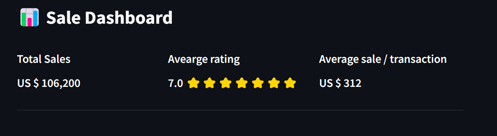
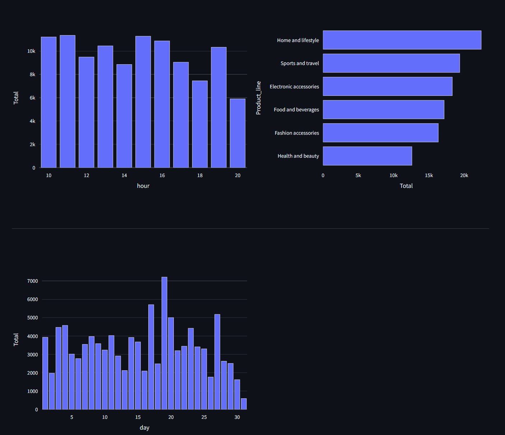

# Interactive Dashboard with streamlit library

In this project, I have created an interactive dashboard using Streamlit for a supermarket sales dataset and extracted insights and patterns from it. Streamlit is an open-source Python library that allows developers to build web applications using Python to display plots and outputs in an interactive environment, as opposed to simple static images like those created with Matplotlib or Seaborn. This dashboard offers a user-friendly interface for users to explore the data and gain valuable insights into supermarket sales. I utilized the Plotly Express framework to create interactive plots and visualizations.
 
 

## What are the options of this dashboard?
This dashboard created from three main parts including:
1) Sidebar
2) Total KPIs
3) Charts

## Sidebar
The sidebar features five different sorting options, encompassing all categorical variables present in the dataset. This functionality enables users to sort and filter the dataset based on their specific requirements. For example, if you wish to view the income of branch A for female members, you can easily select these criteria from the sidebar, and voilà!
 
 

## Total KPIs & Charts
<h2>KPIs</h2>

In this part of dashboard, total KPIs are visible. These values will dynamically change when you adjust the sorting options in the sidebar.

  

<h2>Charts</h2>

In this section of the dashboard, three charts are visible, displaying total income per hour (top left), total income per product line (top right), and total income per day (bottom left). These values will dynamically change when you adjust the sorting options in the sidebar.

  

