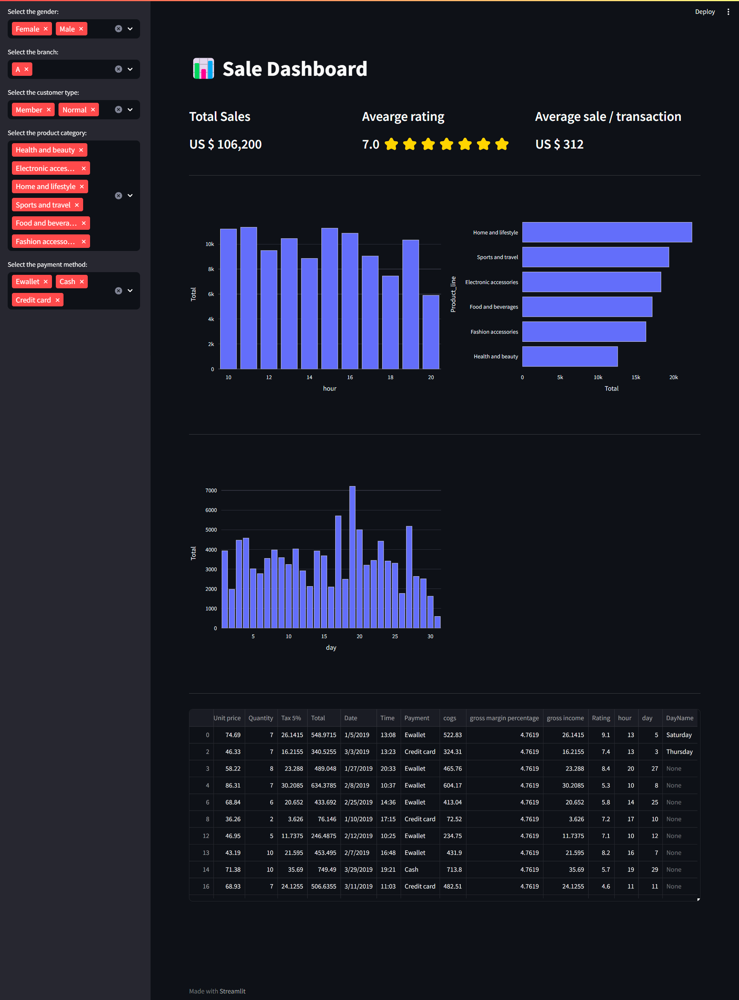
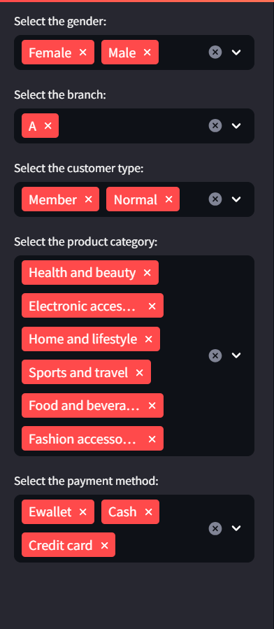

# Interactive Dashboard with streamlit library
In this project, I have created an interactive dashboard for a supermarket sales dataset and extracted insights and patterns from it. This dashboard offers a user-friendly interface for users to explore the data and gain valuable insights into supermarket sales. I utilized the Plotly Express framework to create interactive plots and visualizations.
 
 

## What are the options of this dashboard?
This dashboard created from three main parts including:
1) Sidebar
2) Total KPIs
3) Charts

## Sidebar

